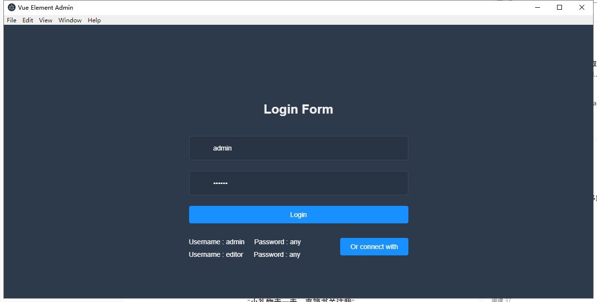
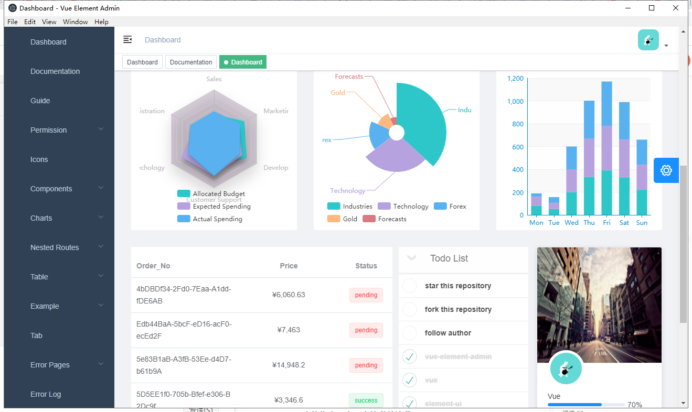
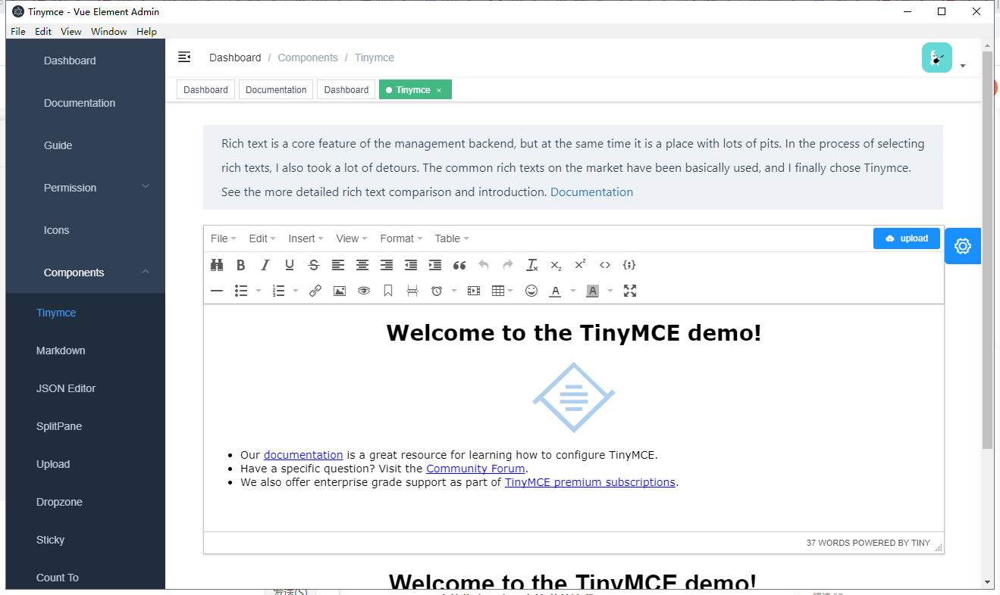
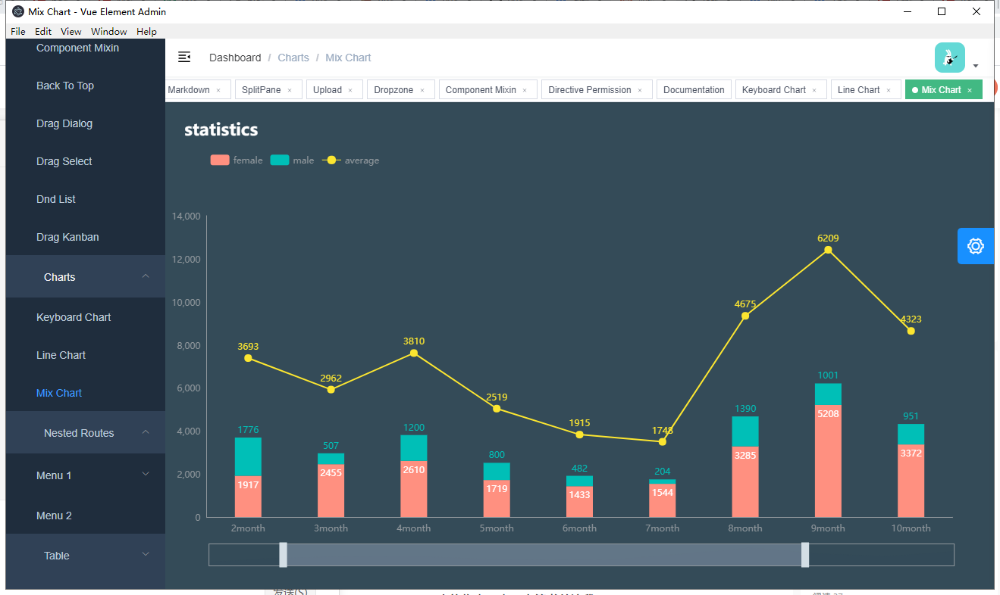
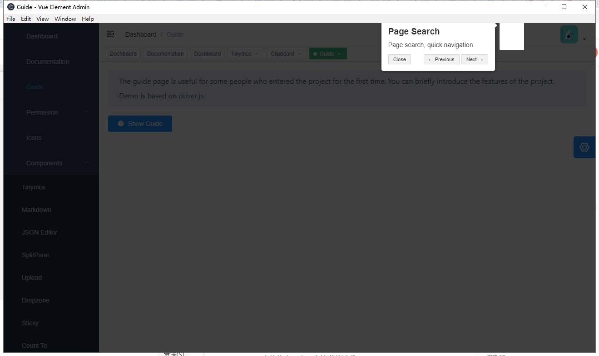

# vuetemplate

> An electron-vue project

vue-admin-template的electron版本

# 存在问题
1. yarn run build 之后报错 "Maximum call stack size exceeded"
2. Icons 不显示
3. tuieditor 通过 yarn 安装会一直卡住，暂时注释掉了
4. Table/Drag Table 提示 Error in callback for immediate watcher "data":"TypeError: Cannot read property 'reduce' of null"
5. Error Log 提示 Cannot read property 'a' of undefined

其他的没什么问题，能力有限，上述问题未能解决

# 效果图










#### Build Setup

``` bash
# install dependencies
yarn

# serve with hot reload at localhost:9080
yarn run dev

# build electron application for production
yarn run build


```

---

This project was generated with [electron-vue](https://github.com/SimulatedGREG/electron-vue)@[45a3e22](https://github.com/SimulatedGREG/electron-vue/tree/45a3e224e7bb8fc71909021ccfdcfec0f461f634) using [vue-cli](https://github.com/vuejs/vue-cli). Documentation about the original structure can be found [here](https://simulatedgreg.gitbooks.io/electron-vue/content/index.html).
